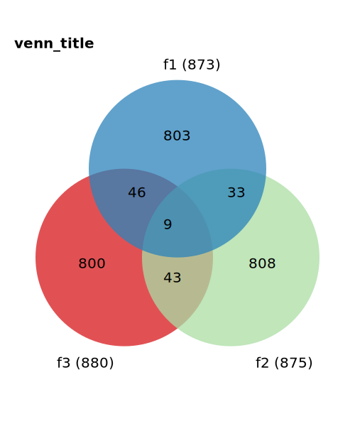

# README for the 🍓strawberry venn generator🍓
Strawberry venn generator is a python package that generates a venn diagram in svg-format from
three files, each containing a list of text elements, e.g. Gene names, numbers, etc.



# Getting Started
First, clone the repository
```
git clone https://github.com/Tabea-K/strawberry_venn_generator.git
```
## Installing
Then, to install the package, simply run this command from within the downlaoded directory
```
python setup.py install
```

Or, using pip, you can omit the step of cloning the repository and simply run
```
pip install git+https://github.com/Tabea-K/strawberry_venn_generator.git
```

# Usage
To run the strawberry venn generator, run from any directory:

```
strawberry-venn-generator output.svg file1.txt file2.txt file3.txt set1name set2name set3name
```

The strawberry venn generator will create unique sets of all lines within each input file and will compare these with each other.
The result is displayed on the venn output file `output.svg`.

If you want to use the three test files included in this repository, you can locate them with this command:

```
ls $(pip show -f strawberry-venn-generator | grep Location | cut -f2 -d" ")/strawberry_venn_generator/tests/test_files/file*.txt
```

# Contribute
If you want to add/edit this package, please feel free to contribute!
